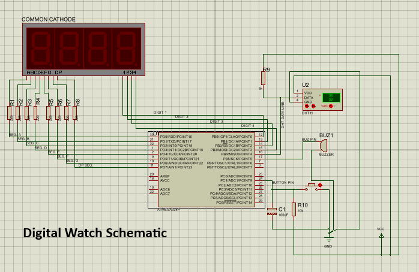

# Digital Watch

A custom AVR-based digital watch project built around interrupt-driven firmware, a multiplexed 4-digit 7-segment display, and a DHT11 temperature/humidity sensor interface. The project is designed as a practical embedded systems build where the timing core, display refresh, sensor acquisition, and user interaction are all handled with self-developed libraries.

The current implementation intentionally focuses on the final working feature set. The potentiometer and LED-array ideas were dropped/cancelled, and the firmware now revolves around the watch, sensor reading, buzzer feedback, and display control only. Future builds might include advanced features like time polling from a NTP server, alarm clock etc.

---

## Features

- **Real‑time clock** with hours, minutes, seconds, day, month, and year (supports leap years).
- **12‑hour format** with AM/PM indicator.
- **Temperature** (°C) and **humidity** (%RH) readings from DHT11.
- **Automatic cycling** through time → temperature → humidity → date on every button press (short click).
- **Setup mode** (entered by long press) to adjust:
  - Hour & minute
  - Day & month
  - Year
- **Flicker effect** on the edited digits during setup.
- **Buzzer** confirmation on valid button actions.
- **Display auto‑off** after about 2 seconds of inactivity (power saving).
- **Pin‑change interrupt** for DHT11 communication – efficient and non‑blocking.
- **Custom built libraries** (`4D_7S`, `DHT_11`) that integrate seamlessly with the ISR architecture.

---

## Overview

This project implements a compact digital watch that can:

- Display time in a 12-hour format with a PM indicator.
- Display ambient temperature and humidity from a DHT11 sensor.
- Display date in day/month format.
- Enter a setup mode for adjusting time and calendar values.
- Automatically refresh the display using timer-based multiplexing.
- Read the DHT11 sensor using pin-change interrupts and timer timing.
- Use a buzzer for feedback when the display is activated and when the run session ends.
- Shut the display down after inactivity.

The firmware is intentionally organized around interrupt service routines so the system can remain responsive without blocking the main loop.

---

## Core idea

The watch is built as a small state machine running on an AVR microcontroller. The main loop does not “poll hard” for every event. Instead:

- **Timer0** keeps the time, manages click detection, and controls runtime/power logic.
- **Timer2** drives the 4-digit seven-segment display refresh.
- **Timer1** is used by the DHT11 library to measure the sensor pulse widths.
- **Pin Change Interrupts** capture the DHT11 communication edges.
- A **single push button** controls display cycling and setup interaction.
- A **buzzer** provides simple audible feedback.

This makes the design compact, responsive, and suitable for a bare-metal AVR environment.

---

## Major features

### 1) Timekeeping
The watch stores:

- `hour`
- `minute`
- `seconds`

The clock runs in 12-hour mode and uses `pm_indicator` to show AM/PM state. When the hour rolls from 12 back to 1, the PM flag toggles.

### 2) Calendar support
The firmware also stores:

- `day`
- `month`
- `year`

The days-in-month logic is updated using a month/year-aware day overflow macro, so the date can be stepped correctly during setup.

### 3) Sensor display
The DHT11 is used to show:

- Temperature
- Humidity

These are read periodically and cached in firmware variables, then displayed on request.

### 4) Setup mode
The watch supports a setup flow for:

- Hour
- Minute
- Day
- Month
- Year

The user moves through setup states and increases values using the same button input, with short/long click behavior handled in interrupt logic.

### 5) Display flicker/blink effects
The display library includes a custom flick mode that blinks selected digits while preserving the rest of the output. This is used to indicate editable fields during setup.

### 6) Buzzer feedback
The buzzer is used as a simple interaction cue when the display wakes and when the session ends.

---

## Circuit Schematic

Circuit schematic is shown below:



Some pictures of working circuit:


---

## Hardware Requirements

### Microcontroller
- Any AVR with at least 2 timers, pin‑change interrupts, and sufficient I/O (e.g., ATmega328P, ATmega8, ATmega88).

### Components
| Component               | Recommended Part / Type               |
|-------------------------|---------------------------------------|
| 4‑digit 7‑segment display | Common‑cathode, 12‑pin multiplexed |
| DHT11 sensor            | Temperature + humidity                |
| Push button             | Tactile switch                        |
| Buzzer                  | Passive or active (active used here)  |
| Resistors               | 220Ω current limiting for segments   |
| Power supply            | 5V DC                                |

### Pin Connections (customise in `pinDefines.h` & `config.h`)

| Function             | Port / Pin (example) | Definition in code                 |
|----------------------|----------------------|-------------------------------------|
| Segment lines (8)    | PORTD (PD0‑PD7)      | `LED_LIVE_PORT`                     |
| Digit select lines (4)| PORTB (PB0‑PB3)      | `LED_GROUND_PORT`<br>`LED_GP1`…`LED_GP4` |
| Push button          | PORTB, e.g., PB4     | `PUSH_BUTTON`, `PB_PIN`             |
| Buzzer               | PORTB, e.g., PB5     | `BUZZER`, `BUZZER_PORT`             |
| DHT11 data line      | PORTC, e.g., PC0     | `DHT_PORT`, `DHT_PIN` (port number 1/2/3) |

> All pin assignments are defined in the project’s header files (`pinDefines.h`, `config.h`) and can be adapted without changing library code.

---

## Software Overview

### Toolchain & Libraries
- **AVR‑GCC** compiler.
- **Custom headers**: `pinDefines.h`, `config.h`, `reg_defs_t.h` (provides abstract register names like `_OCR0A_`, `_TCR1B_`, etc.).
- **Self‑developed libraries**:
  - `4D_7S` – 4‑digit 7‑segment multiplexing with flicker, decimal point, and custom character output.
  - `DHT_11` – Pin‑change interrupt based DHT11 reader with automatic checksum validation.
- **AVR Libc** (`<avr/io.h>`, `<avr/interrupt.h>`, `<util/delay.h>`, `<avr/power.h>`, `<util/atomic.h>`).

### Code Structure

```text
main.c
├── includes & global variables
├── TIMER0_COMPA ISR → time update (seconds/minutes/hours), button press duration, buzzer timing
├── PCINT0_vect ISR → DHT11 bit reception (from DHT_11 library)
├── main()
│ ├── initTimer0()
│ ├── initLED_DISPLAY()
│ ├── DHT_Init()
│ ├── setPin() for 4D_7S digit lines
│ └── super loop:
│ ├── button_state triggered display cycling
│ ├── setup_flag → setupWatch()
│ ├── update_tnh → fetch new DHT11 data
│ └── auto‑off handling
4D_7S.c/h
├── TIMER2_COMPA ISR → dynamic digit multiplexing
├── DISPLAY(), DISPLAY_wChar(), DISPLAY_flick(), DISPLAY_nDP(), DISPLAY_reset()
└── internal digit extraction & pattern mapping
DHT_11.c/h
├── DHT_StartSignal()
├── DHT_HandleSignal() → called from PCINT ISR
├── DHT_Get_Temp(), DHT_Get_Humidity()
└── TIMER1_OVF ISR → timeout guard for DHT readings
```


---

## Hardware concept

The project assumes a typical AVR microcontroller setup with:

- A 4-digit seven-segment display.
- A DHT11 sensor.
- A push button with pull-up configuration.
- A buzzer.
- GPIO pins wired through custom abstraction headers.

The code uses direct register access through AVR headers and project-specific register macros, so the build is suited to low-level embedded hardware control.

---

## Software architecture

The project is split into three major firmware layers:

### Main application
The `main()` file handles:

- System initialization.
- Display mode selection.
- Setup mode control.
- Sensor update triggering.
- Power/run state management.
- Interaction with the buzzer.

### `4D_7S` display library
This library handles:

- Digit multiplexing.
- Seven-segment encoding.
- Decimal point control.
- Blinking selected digits.
- Safe display reset and reinitialization.

### `DHT_11` sensor library
This library handles:

- DHT11 start signal generation.
- Edge capture through pin-change interrupts.
- Pulse width timing with Timer1.
- Checksum verification.
- Humidity/temperature extraction.

All three parts are designed to cooperate cleanly with interrupts.

---

## Libraries used

The project includes standard AVR headers plus custom project headers.

### Standard AVR headers
- `<avr/io.h>`
- `<avr/interrupt.h>`
- `<util/delay.h>`
- `<avr/power.h>`
- `<util/atomic.h>`

These provide register access, ISR support, delays, prescaler control, and atomic blocks.

### Custom/self-developed headers
- `4D_7S.h`
- `DHT_11.h`
- `reg_defs_t.h`
- `pinDefines.h`
- `config.h`

These are project-specific and they define:

- Register alias macros.
- Pin and port names.
- Timing constants.
- Display constants.
- Sensor timing thresholds.
- Button thresholds.
- Clock-related values.

---

## Main program flow

The `main()` routine performs the following tasks:

1. Sets the CPU clock prescaler to full speed.
2. Initializes Timer0.
3. Initializes the 4-digit display system.
4. Initializes the DHT11 sensor interface.
5. Reads the first temperature and humidity values.
6. Configures the push button input with pull-up.
7. Configures the buzzer output.
8. Computes the day overflow value for the current month/year.
9. Enters the infinite service loop.

After startup, the firmware mostly reacts to flags raised in interrupts.

---

## Display modes

The button cycles through four normal display sections:

### Section 0: Time
Shows `hour:minute` with the PM indicator.

### Section 1: Temperature
Shows the current DHT11 temperature.

### Section 2: Humidity
Shows the current DHT11 humidity.

### Section 3: Date
Shows `day/month`.

The section index is stored in `button_click` and wraps around after the last section.

---

## Setup mode behavior

When the button interaction enters setup mode, the watch shifts from normal display cycling to editable fields.

The setup fields are:

0. **Hour**
1. **Minute**
2. **Day**
3. **Month**
4. **Year**

The `setupWatch()` routine displays the current field and uses the flick/blink function to make the editable digits stand out.

When a field is confirmed and increased, `handleSetup()` performs the actual value update with proper overflow handling.

### Hour handling
- Increments the hour.
- Wraps back to `1` after the maximum.
- Toggles PM when the wrap occurs.

### Minute handling
- Increments the minute.
- Wraps back to `0` after the maximum.

### Day handling
- Increments the day.
- Wraps back to `1` when it exceeds the day limit for the current month/year.

### Month handling
- Increments the month.
- Wraps back to `1` after the maximum month value.
- Recomputes the day overflow value after changing the month.

### Year handling
- Increments the year.
- Wraps to the configured valid year start if the maximum is exceeded.

---

## Timekeeping strategy

The clock uses **Timer0 compare match** as the heartbeat of the entire system.

Inside the Timer0 ISR:

- An overflow counter accumulates compare events.
- Once the configured threshold is reached, one second is counted.
- Seconds roll over at 60.
- Minutes roll over at 60.
- Hours roll over according to the 12-hour design.
- PM toggles on the hour wrap boundary.
- A sensor update request is flagged at the start of a new hour.
- Buzzer timing is also managed here.
- Button press duration is sampled here for click classification.
- Runtime inactivity is counted for shutdown logic.

This means the watch can remain synchronized and responsive without blocking delays in the main loop.

---

## Button handling

A single push button is used for:

- Waking the display.
- Cycling through display sections.
- Entering setup interaction.
- Increasing values in setup mode.

The button is configured with a pull-up resistor, and its press duration is measured in the Timer0 ISR.

The logic distinguishes between:

- **Short Clicks**
- **Longer Press Windows**

These thresholds are controlled by configuration macros such as `SHORT_CLICK` and `LONG_CLICK`.

The button state machine is split between:

- Interrupt-side duration detection.
- Main-loop action execution.

This keeps the input system lightweight and stable.

---

## Power/run control

The project includes a simple runtime/power management concept:

- `power_on` tracks user interaction activity.
- `endRun_flag` marks display life-cycle transitions.
- `OPR_TIME` defines how long the display stays active after use.

When activity stops, the main loop resets the display and calls `endRun()`.

### `init4D_7S()`
This function powers up the display lines, primes the buzzer behavior, and marks the display as active.

### `endRun()`
This function:

- Marks the end-run state.
- Triggers buzzer feedback.
- Disables the display GPIO directions.
- Clears setup and button state variables.
- Resets display-related flags.
- Turns the display off logically and electrically.

This helps the project behave like a proper battery-friendly watch rather than a permanently lit demo.

---

## DHT11 integration

This is a custom DHT11 library which I made and is can be viewed on [this link](https://github.com/muazdawud/4D_7S-AVR-Library).

---

## 4-digit seven-segment display library

This is a custom 4-digit 7-segment display library which I made and is can be viewed on [this link](https://github.com/muazdawud/DHT_11-AVR_Library). But I made some significant changes to the original varsion for it to suit the project.

---

## Display API summary

The project provides the following custom-added/modified display functions.

### `DISPLAY(num, pm_check)`
Shows a plain numeric value, typically time.

### `DISPLAY_wChar(character, number)`
Displays a custom character pair followed by a number. This is used for text-like sensor labels.

### `DISPLAY_nDP(num)`
Shows a number without decimal points.

### `DISPLAY_flick(number, flick_number, disable_dp, pm_check)`
Shows a number while blinking selected digits.

### `DISPLAY_reset()`
Stops the Timer2 display clock, clears blink state, restores decimal-point settings when needed, and resets the refresh state machine.

---

## Timer usage summary

### Timer0
Used for:

- Clock timekeeping.
- Button timing.
- Buzz timing.
- Inactivity/session timing.

### Timer1
Used for:

- DHT11 application.

### Timer2
Used for:

- 4-digit seven-segment multiplex application.

This separation is one of the strongest parts of the project design.

---

## Interrupts used

### `ISR(PCINT0_vect)`
Routes DHT11 pin-change events into `DHT_HandleSignal()`.

### `ISR(_TIMER0_COMPA_)`
Handles:

- Second counting.
- Minute/hour updates.
- PM toggling.
- Runtime timeout.
- Buzzer timing.
- Button press duration tracking.
- Setup interaction triggers.

### `ISR(_TIMER2_COMPA_)`
Handles the seven-segment multiplex refresh.

### `ISR(_TIMER1_OVF_)`
Acts as the DHT11 timer guard and timeout limiter.

This interrupt structure keeps each subsystem isolated and efficient.
All custom register names are used for Hardware Abstraction and for cross-platform integration. Macros are defined in `reg_defs_t.h`.

---

## Usage Guide

### Normal Operation (Display On)

- When display is off, press the button once – it turns on and shows the current time (HHMM, with PM indicator dot on the last digit for 12:00–11:59).
- Each subsequent short press cycles through:
  - Temperature (°C) – left two digits show “°C”, right two digits show value.
  - Humidity (%) – left two digits show “%”, right two digits show value.
  - Date (DDMM) – no decimal points.
  - (back to time)
- After ~2 seconds of inactivity, the display turns off automatically.

### Setup Mode (Adjusting Time/Date)

- Long press the button (approx. 1s) while the time is shown.
- The display enters setup mode: the hour digits will flicker.
- Short press to increase the flickering field (hour, then minute, then day, then month, then year).
- After adjusting the year, setup mode ends automatically and normal operation resumes.
- To exit earlier: simply do nothing for ~2s – display turns off, changes are saved.

### Buzzer Feedback

- A short beep is heard when:
- Display turns on.
- A value is increased in setup mode.
- Setup mode ends successfully.

---

## State variables worth knowing

The firmware uses many `volatile` variables because they are shared between the main loop and interrupt routines.

### Watch and setup state
- `setup_flag`
- `setup_click`
- `setup_update`
- `setup_increase`
- `button_state`
- `button_click`

### Time/date state
- `hour`
- `minute`
- `seconds`
- `day`
- `month`
- `year`
- `day_ovf`
- `pm_indicator`

### Runtime/display state
- `power_on`
- `display_on`
- `endRun_flag`
- `ovf_counter`

### Buzzer state
- `buzzer_flag`
- `buzzer_counter`

### Sensor state
- `temp_`
- `humd_`
- `update_tnh`

### Display state
- `display_number`

---

## Build assumptions

The project is designed for an AVR device with:

- Timer0, Timer1, and Timer2 available,
- pin-change interrupts available,
- direct port access to `PORTB`, `PORTC`, and `PORTD`,
- a system clock controlled by `clock_prescale_set(clock_div_1)`.

It is best treated as a bare-metal AVR project built with AVR-GCC.

---

## Practical usage flow

A typical user flow looks like this:

1. Power the board.
2. The firmware initializes the display and reads the DHT11.
3. Press the button to wake the display.
4. Cycle through:
   - Time.
   - Temperature.
   - Humidity.
   - Date.
5. Hold or interact through the setup logic to adjust time/date.
6. Leave the watch idle and allow it to shut down after the configured active window.

---

## Design Features

This project has a strong embedded design choices:

- Clear separation of display, sensor, and application logic.
- Interrupt-driven timing instead of blocking loops.
- Custom libraries tailored to the exact hardware.
- Efficient multiplexing for the seven-segment display.
- Checksum-verified DHT11 communication.
- Clean runtime shutdown behavior.
- Compact single-button user interface.

---

## Advanced Implementation Notes

### ISR Efficiency

- The LED multiplexing ISR (TIMER2_COMPA) is kept extremely short – only a few assignments and a port write. No lengthy loops or delays.
- DHT11 pin‑change ISR does minimal work (timestamp capture, bit assembly) – the heavy parsing happens in the main loop after the reading completes.

### Atomic Blocks

- Critical sections (e.g., updating display_number from ISR, resetting the display control registers) are enclosed in ATOMIC_BLOCK(ATOMIC_FORCEON) to prevent race conditions.

### Power Saving

- When display_on == 0, the endRun() function:
  - Releases the segment and digit port pins (sets DDRegisters to input).
  - Turns off the buzzer.
  - Clears all state flags so that a button press will re‑initialise the display cleanly.

### Leap Year Calculation

- The macro DAY_OVF(month, year) (defined in config.h) returns the number of days in the given month, taking into account leap years for February. This keeps the date handling accurate.

### Known Limitations & Future Improvements

- No second display – seconds are tracked internally but never shown.
- Temperature/humidity decimals are discarded (integer only) to simplify the display routine.
- DHT11 timing is critical; if interrupts are disabled for too long (e.g., in very long _delay_ms calls), bit reception may fail. The current implementation avoids such delays.
- Potentiometer, LED array, ESP8266 – these features have been removed. No code remains for them.

---

## Notes on the custom libraries

The project uses custom libraries rather than external off-the-shelf ones. That matters because these libraries are built to match the exact ISR-driven architecture of the watch. But can be modified to suit other typical projects.

---

## Final summary

The Digital Watch project is a full embedded systems build that combines:

- Real-time timekeeping.
- A date engine.
- DHT11 environmental sensing.
- A multiplexed 4-digit display.
- A buzzer.
- A single-button user interface. and;
- Interrupt-based firmware structure.

This build is a strong example of low-level AVR programming with custom libraries and clean ISR coordination.

It is a watch, a sensor display, and a compact embedded UI project all in one.

---

## License & Acknowledgements

Author: Dauda Muazu Sulaiman

Organization: [KibrisOrder](https://ss.kibrisorder.com)

All libraries (`4D_7S`, `DHT_11`) are released under the MIT License – see the LICENSE file in the project root.

Special thanks to the AVR community for register abstraction ideas.

Contact & Support:
For questions or contributions, please refer to the project’s repository or contact KibrisOrder through the official website: https://ss.kibrisorder.com

---

*"Good and rigid answers are the foundation of stable systems."*
*(I hope this will be useful to the public and the opensource world)*